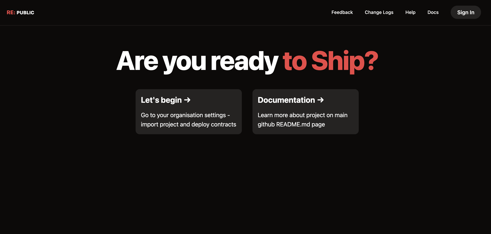
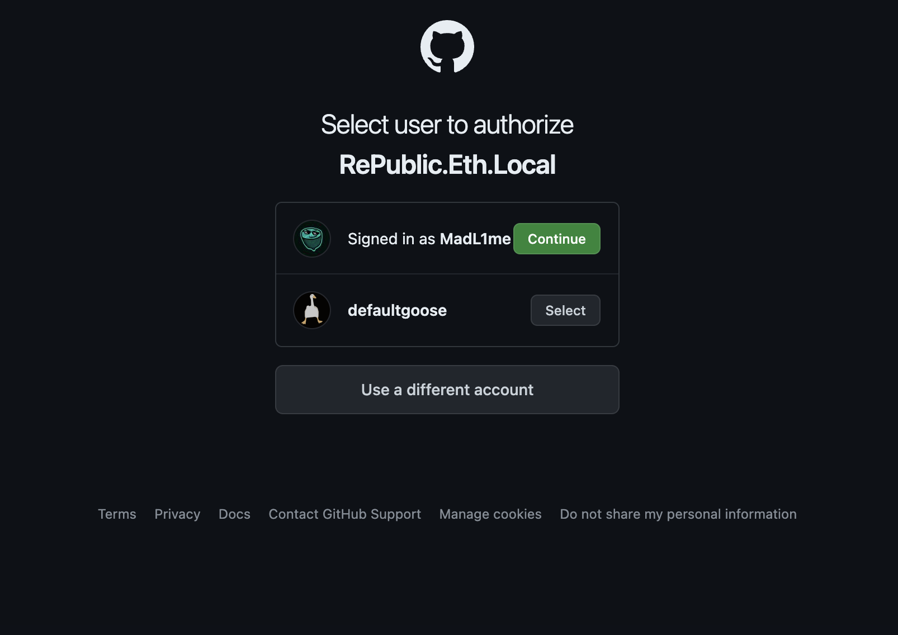
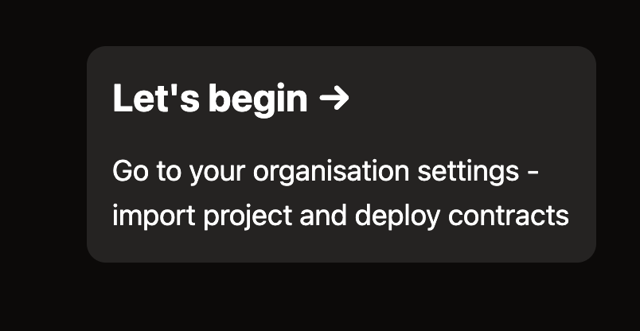
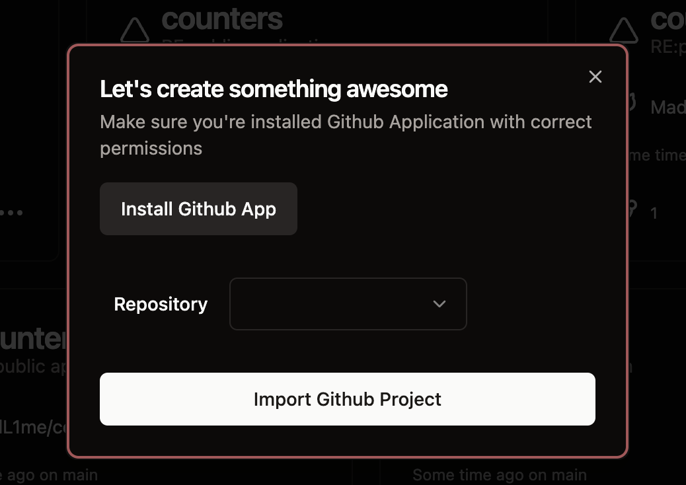

# Showcase

At the start, you'll see following picture!

Firstly, you need to authenticate with your Github account, by clicking "Sign In" button in navbar:

After successfully signing in, just click "Let's begin":

Shortly after, you will see following picture:

Click on "Install Github App", to use integration at maximum
